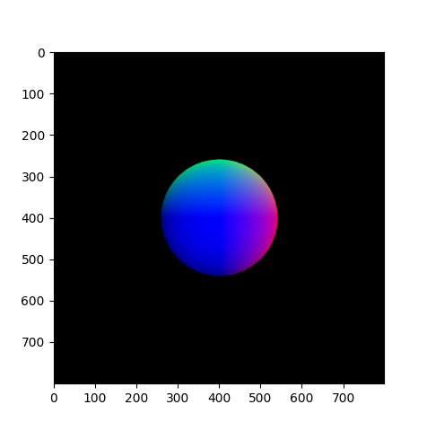
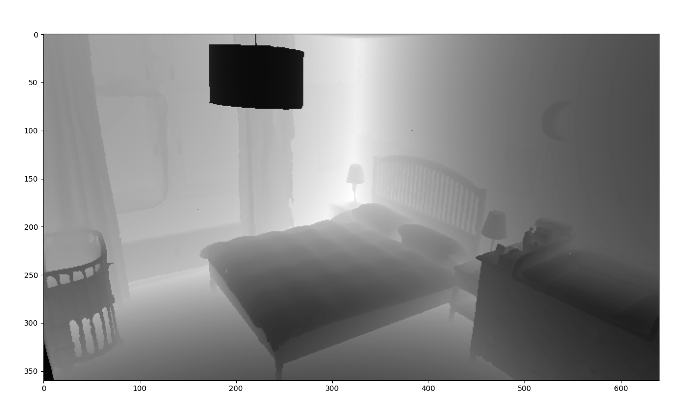

# Triro - An in-place replacement for trimesh.ray in OptiX

Triro is a [trimesh.ray](https://trimesh.org/trimesh.ray.html) implementation using NVIDIA Optix.

## 🔧️ Installation

>⚠️ There are problems installing and building the shaders on Windows.

First
```sh
export OptiX_INSTALL_DIR=<Your Optix SDK installation directory>
```
Then
```sh
pip install git+https://github.com/lcp29/trimesh-ray-optix
```
or
```sh
git clone https://github.com/lcp29/trimesh-ray-optix
cd trimesh-ray-optix
pip install .
```
## 📖️ Example
```python
import trimesh
import matplotlib.pyplot as plt
from triro.ray.ray_optix import RayMeshIntersector

# creating mesh and intersector
mesh = trimesh.creation.icosphere()
intersector = RayMeshIntersector(mesh)

# generating rays
x, y = torch.meshgrid([torch.linspace([-1, 1, 800]), 
                       torch.linspace([-1, 1, 800])], indexing='ij')
z = -torch.ones_like(x)
ray_directions = torch.cat([x, y, z], dim=-1).cuda().contiguous()
ray_origins = torch.Tensor([0, 0, 3]).cuda().broadcast_to(ray_directions.shape).contiguous()

# Optix, Launch!
hit, front, ray_idx, tri_idx, location, uv = sr.intersects_closest(
    ray_origins, ray_directions, stream_compaction=True
)

# drawing result
locs = torch.zeros((800, 800, 3)).cuda()
locs[hit] = location
plt.imshow(locs.cpu())
plt.show()
```
The above code generates the following result:



## 🕊️ TODOs

 - [ ] Installation on Windows
 - [ ] Other tensor layouts as input

## 🚀️ Performance Comparison

Scene closest-hit ray tracing tested with i5-13490F and RTX 3090:
```
GPU time: 8.121 s / 100000 iters
Trimesh & PyEmbree CPU time: 19.454 s / 100 iters
speedup: 2395x
```



## 🔍️ Documentation

The Trimesh document is [here](https://trimesh.org/trimesh.ray.html).

For detailed document see [here](docs/DOC.md) or the [wiki](https://github.com/lcp29/trimesh-ray-optix/wiki).
